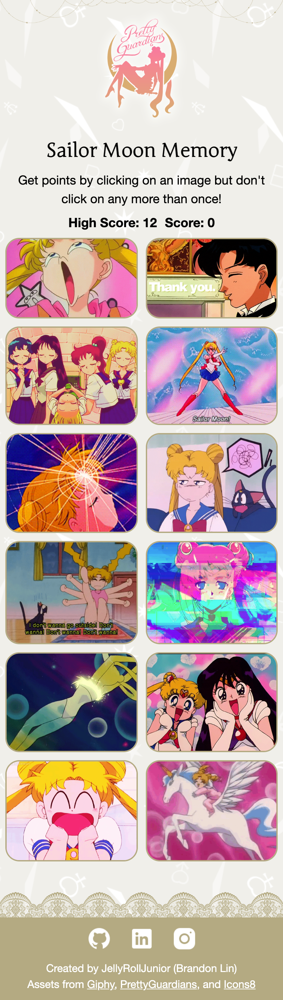
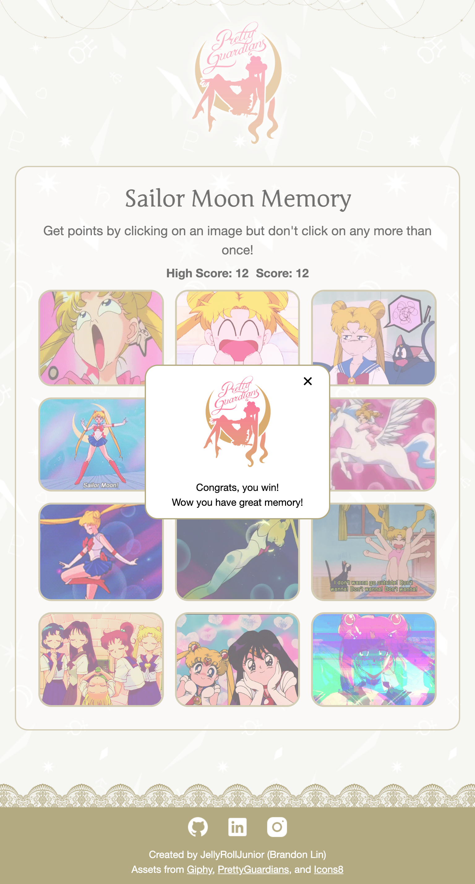

<h1 align="center">Sailor Moon Memory</h1>
<h3 align="center">Play a Sailor Moon themed game of memory <a href='https://sailor-moon-memory.netlify.app/'>here</a>!</h3>

    

### Features
-   Two stunning view modes!
    -   Mobile
    -   Tablet / Desktop
-   Get points by clicking on an image but don't click on any more than once!
- Scoreboard & High Score

### Stack
- React - JSX
- CSS
- HTML
- Git / GitHub
- Netlify

## Learning Outcomes
- First time using state, useEffect, and fetching API with react
- how to make a footer stay at the bottom of a webpage
    - Make body min-height 100vh
    - Make main have 200px padding bottom (height of footer)
    - Position footer absolutely at bottom of body

## Responsive Layout Showcase

| Mobile | Tablet | Laptop  | 
|  ----- |  ----- |  ------ | 
| 425px  | 768px  | 1440px  | 
|  |  |  | 

## Retrospective (aka yapping)
This project was fun and not too complicated. The trickiest part was making the footer stick to the bottom. I think this is a really nicely done website that I'm proud of! Although the theme is mostly copied from the pretty guardians website haha. Good practice!

## Acknowledgements

| Usage   | Source   |
| ------- | -------------- |
| Artwork | Naoko Takeuchi |
| Assets  | [Pretty Guardians](https://prettyguardians.com/)|
| Gifs    | [Giphy](https://giphy.com/)|
| Icons   | icons8.com     |
| Specs | [The Odin Project](https://www.theodinproject.com/lessons/node-path-react-new-memory-card) |
